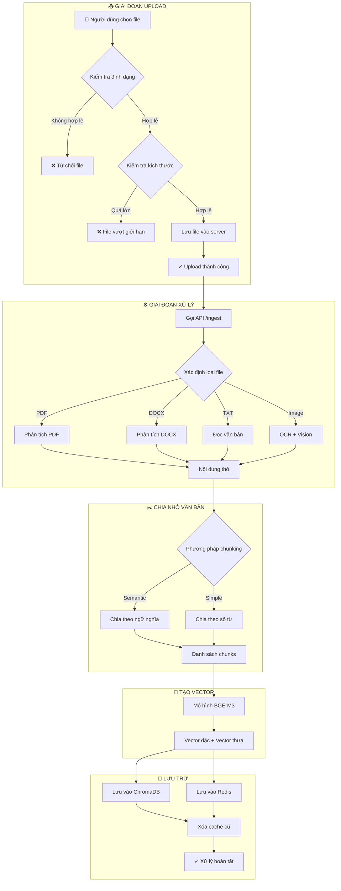
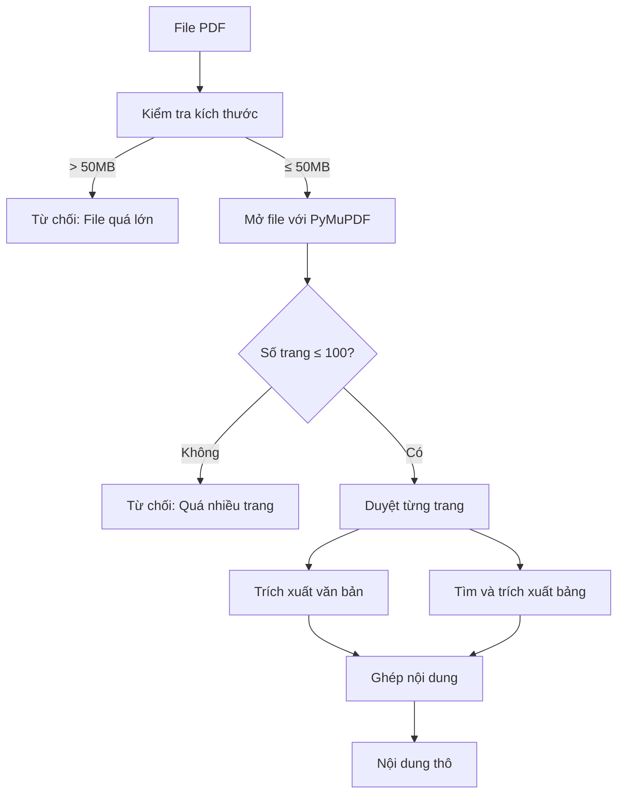
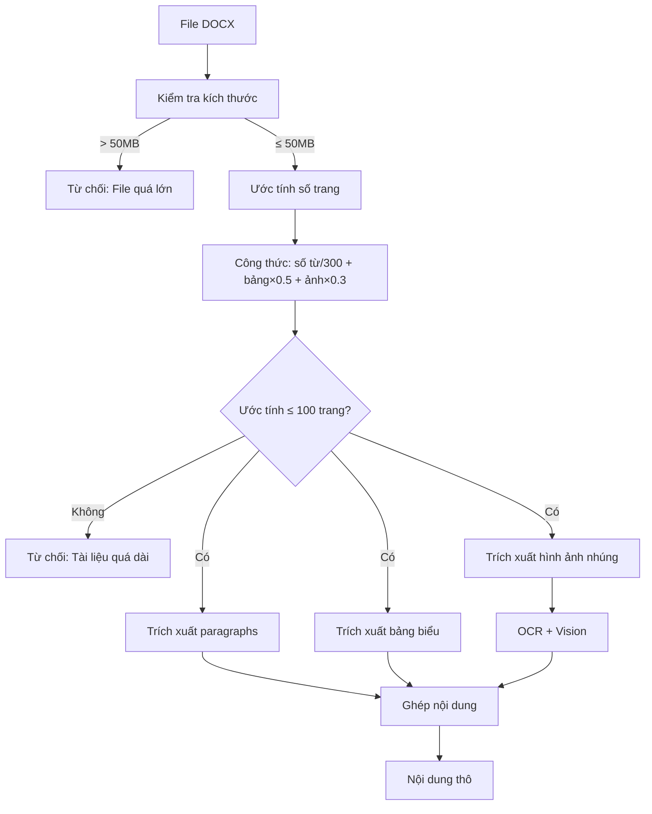
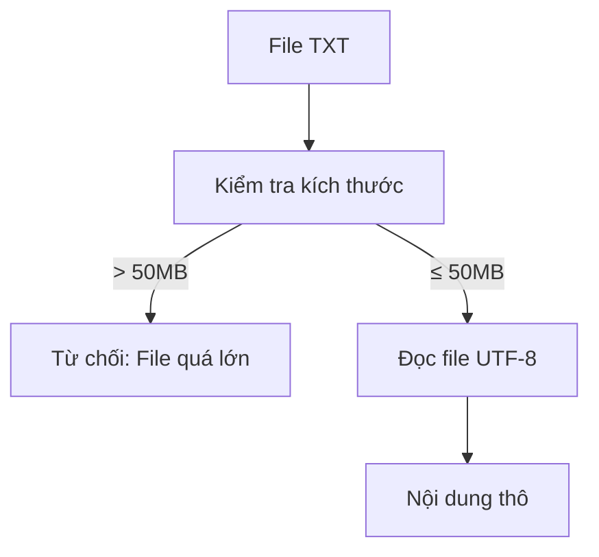
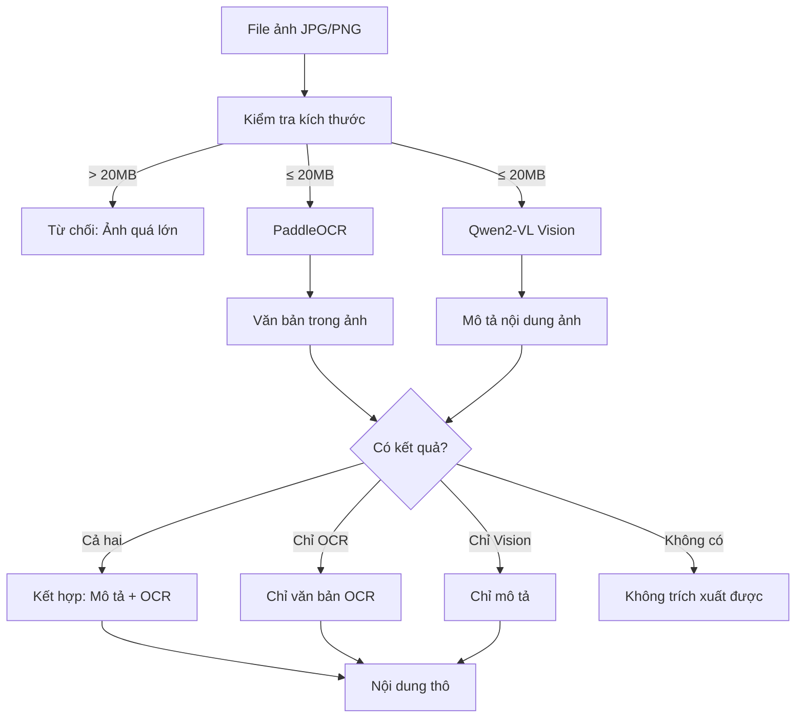
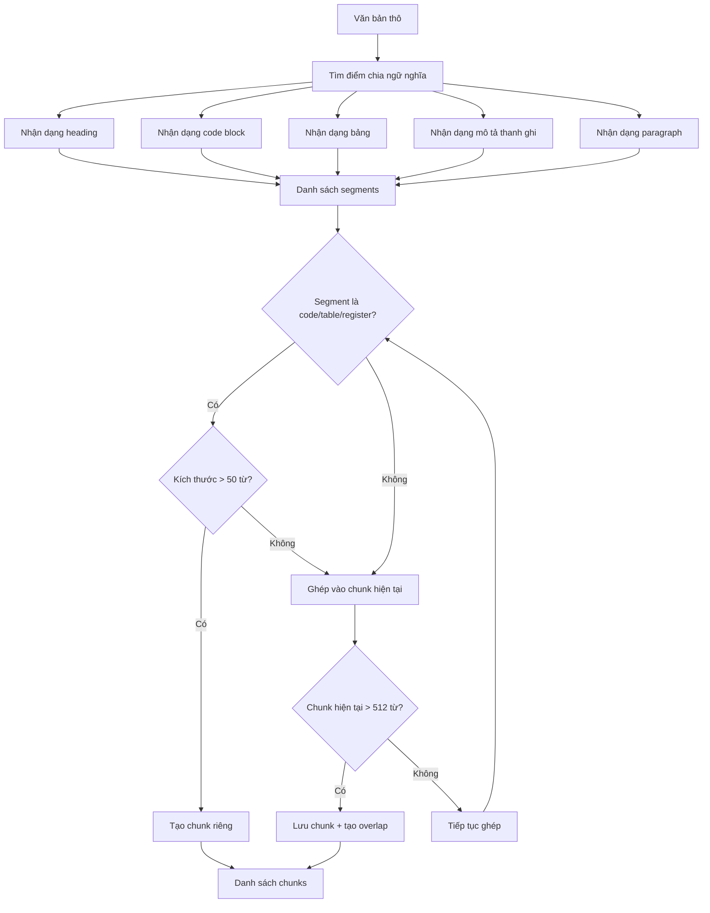

# Báo Cáo Luồng Tải Lên và Xử Lý Tài Liệu

## Mục Lục
1. [Tổng Quan](#1-tổng-quan)
2. [Luồng Xử Lý Tài Liệu](#2-luồng-xử-lý-tài-liệu)
3. [Chi Tiết Từng Giai Đoạn](#3-chi-tiết-từng-giai-đoạn)
4. [Giới Hạn Hệ Thống](#4-giới-hạn-hệ-thống)

---

## 1. Tổng Quan

Luồng tải lên và xử lý tài liệu là quá trình chuyển đổi các file tài liệu thô (PDF, DOCX, TXT, hình ảnh) thành dạng có thể tìm kiếm được trong hệ thống RAG. Quá trình này bao gồm hai giai đoạn chính: tải file lên server và xử lý nội dung để lưu vào cơ sở dữ liệu vector.

### Định dạng hỗ trợ

| Định dạng | Mô tả | Xử lý đặc biệt |
|-----------|-------|----------------|
| PDF | Tài liệu PDF | Trích xuất text + bảng |
| DOCX | Microsoft Word | Trích xuất text + bảng + hình ảnh (OCR) |
| TXT | Văn bản thuần | Đọc trực tiếp |
| JPG/PNG | Hình ảnh | OCR + Vision captioning |

---

## 2. Luồng Xử Lý Tài Liệu

### 2.1 Tổng Quan Luồng Xử Lý

Khi người dùng tải tài liệu lên hệ thống, quá trình xử lý bắt đầu bằng việc kiểm tra định dạng file. Hệ thống chỉ chấp nhận các định dạng được hỗ trợ bao gồm PDF, DOCX, TXT và hình ảnh. Nếu định dạng không hợp lệ, tài liệu bị từ chối ngay lập tức. Tiếp theo, hệ thống kiểm tra kích thước file để đảm bảo không vượt quá giới hạn cho phép. File quá lớn cũng sẽ bị từ chối. Sau khi vượt qua hai bước kiểm tra này, file được lưu vào hệ thống.

Hệ thống tiến hành xác định loại tài liệu dựa trên phần mở rộng. Nếu là file DOCX, hệ thống phân tích bằng thư viện python-docx để trích xuất văn bản, bảng biểu và hình ảnh nhúng. Nếu là file TXT, hệ thống đọc trực tiếp nội dung văn bản. Nếu là file hình ảnh, hệ thống áp dụng OCR kết hợp với mô hình Vision để nhận dạng và mô tả nội dung. Nếu không phải các loại trên thì đó là file PDF, hệ thống sử dụng PyMuPDF để trích xuất văn bản và bảng biểu từ từng trang. Kết quả từ tất cả các phương pháp phân tích đều cho ra nội dung thô dạng văn bản.

Từ nội dung thô, hệ thống thực hiện hai luồng xử lý song song. Luồng thứ nhất kết hợp nội dung thô với các thông tin metadata như tên file, loại tài liệu và thời gian xử lý, sau đó lưu vào Redis. Luồng thứ hai chia nhỏ nội dung thô thành các đoạn văn bản theo ngữ nghĩa hoặc theo số từ, tạo ra danh sách các chunk. Mỗi chunk được đưa qua mô hình embedding BGE-M3 để tạo ra vector đặc và vector thưa, sau đó lưu vào ChromaDB. Sau khi cả hai luồng lưu trữ hoàn tất, hệ thống xóa lịch sử câu hỏi đã lưu trữ trong cache để đảm bảo các truy vấn tiếp theo sẽ tìm kiếm trên dữ liệu mới nhất.

### 2.2 Flowchart Tổng Quan

---

## 3. Chi Tiết Từng Giai Đoạn

### 3.1 Giai Đoạn Upload

Giai đoạn upload đảm nhận việc tiếp nhận và lưu trữ file từ người dùng. Hệ thống thực hiện hai bước kiểm tra quan trọng trước khi chấp nhận file.

Bước kiểm tra định dạng xác minh phần mở rộng của file có thuộc danh sách được hỗ trợ hay không. Danh sách này bao gồm các định dạng tài liệu phổ biến như PDF và DOCX, định dạng văn bản thuần TXT, cùng các định dạng hình ảnh JPG, JPEG và PNG. Nếu file có định dạng không được hỗ trợ, hệ thống từ chối ngay lập tức và thông báo cho người dùng biết các định dạng được chấp nhận.

Bước kiểm tra kích thước đảm bảo file không vượt quá giới hạn 50 megabyte. Giới hạn này được đặt ra để tránh quá tải server và đảm bảo thời gian xử lý hợp lý. Với các tài liệu lớn hơn, người dùng được khuyến khích chia nhỏ thành nhiều file.

Sau khi vượt qua cả hai bước kiểm tra, file được lưu vào thư mục upload trên server. Hệ thống trả về thông tin bao gồm tên file, đường dẫn lưu trữ, kích thước thực tế và trạng thái upload thành công.

### 3.2 Giai Đoạn Phân Tích Tài Liệu

Mỗi loại tài liệu được xử lý bằng phương pháp riêng biệt để trích xuất nội dung một cách tối ưu.

**Phân tích PDF**

Với file PDF, hệ thống sử dụng thư viện PyMuPDF để đọc từng trang. Ngoài việc trích xuất văn bản thuần, hệ thống còn nhận dạng và trích xuất các bảng biểu có trong tài liệu. Mỗi trang được đánh dấu số thứ tự để giữ nguyên cấu trúc tài liệu. Hệ thống giới hạn xử lý tối đa 100 trang để đảm bảo hiệu suất.

**Phân tích DOCX**

Với file Word, hệ thống trích xuất ba loại nội dung: văn bản từ các đoạn paragraph, dữ liệu từ các bảng biểu, và nội dung từ hình ảnh nhúng. Đặc biệt, các heading trong tài liệu được giữ nguyên định dạng để phản ánh cấu trúc phân cấp của nội dung. Hình ảnh nhúng trong file DOCX được trích xuất và xử lý bằng OCR kết hợp với mô hình vision để mô tả nội dung.

**Phân tích hình ảnh**

Với file hình ảnh, hệ thống áp dụng hai phương pháp song song. OCR sử dụng PaddleOCR để nhận dạng văn bản trong ảnh, hỗ trợ cả tiếng Việt và tiếng Anh. Vision captioning sử dụng mô hình Qwen2-VL để tạo mô tả nội dung tổng thể của hình ảnh. Kết quả từ hai phương pháp được kết hợp để tạo ra nội dung văn bản đầy đủ nhất.

### 3.3 Giai Đoạn Chia Chunks

Sau khi trích xuất được nội dung thô, hệ thống tiến hành chia nhỏ thành các đoạn có kích thước phù hợp cho việc tìm kiếm và xử lý. Hệ thống hỗ trợ hai phương pháp chunking.

**Semantic Chunking**

Phương pháp này phân tích cấu trúc ngữ nghĩa của văn bản để xác định các điểm chia tự nhiên. Hệ thống nhận dạng các loại nội dung đặc biệt như khối code, bảng biểu, mô tả thanh ghi và heading. Những nội dung này được giữ nguyên trong một chunk thay vì bị cắt ngang giữa chừng. Khi một khối code hoặc bảng có kích thước lớn hơn 50 từ, nó được tách thành chunk riêng biệt để đảm bảo tính toàn vẹn.

**Simple Chunking**

Phương pháp đơn giản chia văn bản theo số từ cố định. Mỗi chunk chứa tối đa 512 từ với 50 từ overlap giữa các chunk liên tiếp. Overlap giúp đảm bảo ngữ cảnh không bị mất khi một câu hoặc ý tưởng nằm ở ranh giới giữa hai chunk.

### 3.4 Giai Đoạn Tạo Embedding

Mỗi chunk được chuyển đổi thành vector thông qua mô hình BGE-M3. Mô hình này tạo ra đồng thời hai loại vector: vector đặc 1024 chiều biểu diễn ý nghĩa ngữ nghĩa, và vector thưa chứa trọng số của các từ khóa quan trọng. Cả hai loại vector đều được sử dụng cho việc tìm kiếm lai (hybrid search) trong quá trình hỏi đáp.

### 3.5 Giai Đoạn Lưu Trữ

Kết quả xử lý được lưu vào hai hệ thống lưu trữ khác nhau phục vụ các mục đích khác nhau.

**ChromaDB** lưu trữ các vector embedding cùng với nội dung chunk và metadata. Cơ sở dữ liệu này được sử dụng cho việc tìm kiếm ngữ nghĩa trong quá trình hỏi đáp. Vector đặc được lưu trữ trong chỉ mục HNSW để tìm kiếm nhanh, trong khi vector thưa được lưu dưới dạng JSON trong metadata để xây dựng chỉ mục đảo ngược.

**Redis** lưu trữ văn bản gốc đầy đủ của tài liệu cùng với metadata tổng hợp. Thông tin này được sử dụng để hiển thị danh sách tài liệu, xem chi tiết tài liệu và hỗ trợ việc xóa tài liệu khi cần.

Sau khi lưu trữ hoàn tất, hệ thống xóa bộ nhớ đệm của các câu hỏi đã xử lý trước đó. Điều này đảm bảo rằng những truy vấn tiếp theo sẽ tìm kiếm trong toàn bộ cơ sở tri thức bao gồm cả tài liệu mới, thay vì sử dụng kết quả cache cũ có thể thiếu thông tin từ tài liệu mới.

### 3.6 Flowchart Chi Tiết - Phân Tích PDF

Khi nhận được file PDF, hệ thống đầu tiên kiểm tra kích thước file không vượt quá 50 megabyte. Sau đó, hệ thống mở file bằng thư viện PyMuPDF và đếm số trang. Nếu số trang vượt quá 100, file bị từ chối để tránh quá tải bộ nhớ và thời gian xử lý quá lâu. Với các file hợp lệ, hệ thống duyệt qua từng trang để trích xuất văn bản và tìm kiếm các bảng biểu. Mỗi trang được đánh dấu số thứ tự để giữ nguyên cấu trúc tài liệu. Cuối cùng, toàn bộ văn bản và bảng biểu được ghép lại thành nội dung thô.

### 3.7 Flowchart Chi Tiết - Phân Tích DOCX

File DOCX không có khái niệm trang cố định như PDF, do đó hệ thống ước tính số trang dựa trên công thức: số từ chia 300 cộng với số bảng nhân 0.5 cộng với số ảnh nhân 0.3. Nếu ước tính vượt quá 100 trang, file bị từ chối. Với file hợp lệ, hệ thống trích xuất ba loại nội dung song song: các đoạn văn bản từ paragraphs với việc giữ nguyên định dạng heading, dữ liệu từ các bảng biểu, và hình ảnh nhúng trong tài liệu. Mỗi hình ảnh được xử lý bằng OCR và Vision để chuyển thành văn bản. Cuối cùng, tất cả nội dung được ghép lại.

### 3.8 Flowchart Chi Tiết - Phân Tích TXT

File văn bản thuần là loại đơn giản nhất để xử lý. Hệ thống chỉ cần kiểm tra kích thước file không vượt quá 50 megabyte, sau đó đọc toàn bộ nội dung với mã hóa UTF-8. Nội dung đọc được chính là nội dung thô, không cần qua bước xử lý nào khác.

### 3.9 Flowchart Chi Tiết - Phân Tích Hình Ảnh

File hình ảnh có giới hạn kích thước riêng là 20 megabyte, thấp hơn các loại file khác do việc xử lý ảnh tốn nhiều tài nguyên hơn. Sau khi kiểm tra kích thước, hệ thống xử lý ảnh bằng hai phương pháp song song. PaddleOCR nhận dạng và trích xuất văn bản có trong ảnh, hỗ trợ cả tiếng Việt và tiếng Anh. Qwen2-VL Vision tạo mô tả nội dung tổng thể của hình ảnh, đặc biệt hữu ích cho các sơ đồ, mạch điện và hình ảnh kỹ thuật. Kết quả từ hai phương pháp được kết hợp: nếu cả hai đều có kết quả thì ghép lại, nếu chỉ một phương pháp có kết quả thì sử dụng kết quả đó, nếu không có kết quả nào thì trả về thông báo không trích xuất được nội dung.

### 3.10 Flowchart Chi Tiết - Semantic Chunking

---

## 4. Giới Hạn Hệ Thống

### 4.1 Bảng Giới Hạn

| Tham số | Giá trị | Mô tả |
|---------|---------|-------|
| `MAX_FILE_SIZE_MB` | 50 MB | Kích thước file tối đa |
| `MAX_PDF_PAGES` | 100 trang | Số trang PDF tối đa |
| `MAX_IMAGE_SIZE_MB` | 20 MB | Kích thước ảnh tối đa |
| `CHUNK_SIZE` | 512 từ | Kích thước chunk mặc định |
| `CHUNK_OVERLAP` | 50 từ | Số từ overlap giữa chunks |

### 4.2 Định Dạng Được Hỗ Trợ

| Định dạng | Extension | Thư viện xử lý |
|-----------|-----------|----------------|
| PDF | .pdf | PyMuPDF |
| Word | .docx | python-docx |
| Text | .txt | Built-in |
| JPEG | .jpg, .jpeg | PaddleOCR + Qwen2-VL |
| PNG | .png | PaddleOCR + Qwen2-VL |

---

## 5. Kết Luận

Luồng tải lên và xử lý tài liệu được thiết kế với các đặc điểm:

1. **Linh hoạt**: Hỗ trợ nhiều định dạng tài liệu phổ biến
2. **Thông minh**: Semantic chunking giữ nguyên cấu trúc code và bảng
3. **Toàn diện**: Kết hợp OCR và Vision cho nội dung hình ảnh
4. **Hiệu quả**: Tạo cả dense và sparse vectors cho hybrid search
5. **Đồng bộ**: Tự động xóa cache khi có tài liệu mới

---

*Báo cáo được tạo - Ngày: 2025-12-10*
