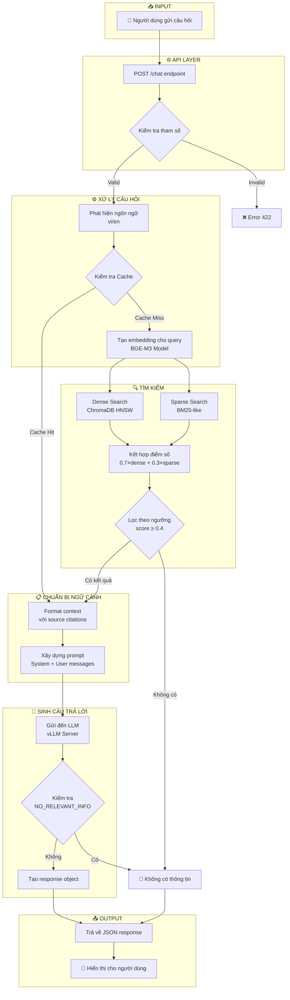
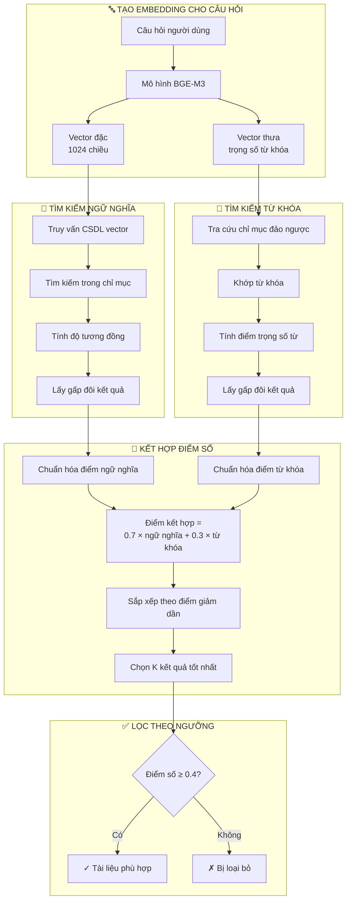
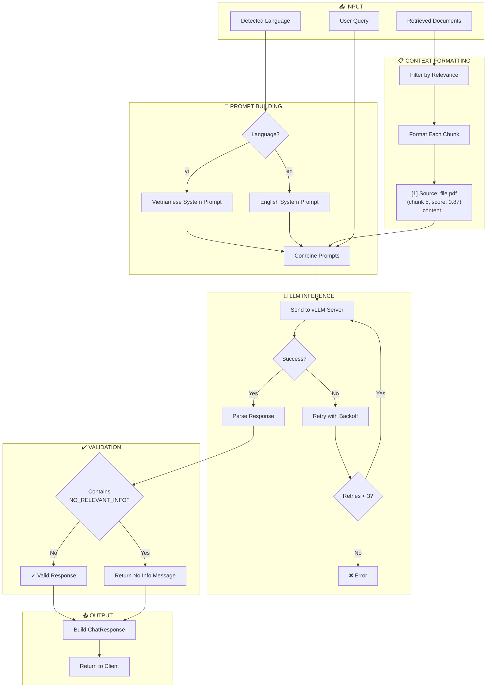
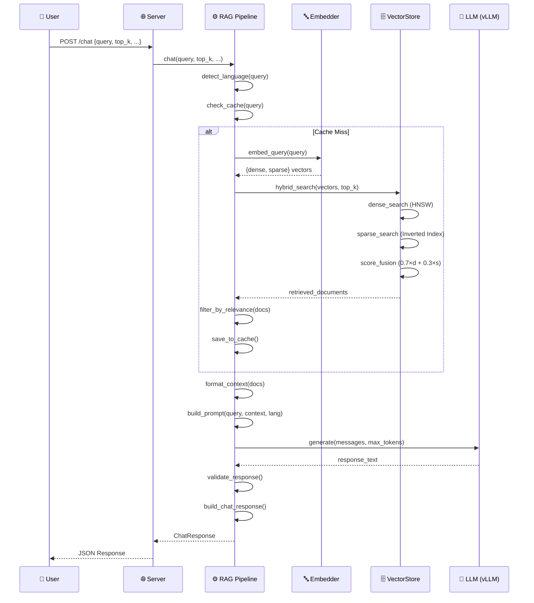

# Báo Cáo Luồng Hỏi Đáp Hệ Thống RAG Chatbot

## Mục Lục
1. [Tổng Quan](#1-tổng-quan)
2. [Kiến Trúc Hệ Thống](#2-kiến-trúc-hệ-thống)
3. [Flowchart Luồng Hỏi Đáp](#3-flowchart-luồng-hỏi-đáp)
4. [Chi Tiết Từng Bước](#4-chi-tiết-từng-bước)
5. [Các Thành Phần Chính](#5-các-thành-phần-chính)
6. [Cấu Hình Hệ Thống](#6-cấu-hình-hệ-thống)

---

## 1. Tổng Quan

Hệ thống RAG (Retrieval-Augmented Generation) Chatbot là một hệ thống hỏi đáp thông minh được xây dựng để hỗ trợ trả lời các câu hỏi về lập trình nhúng (embedded programming). Hệ thống sử dụng kỹ thuật RAG để kết hợp:

- **Retrieval (Truy xuất)**: Tìm kiếm thông tin liên quan từ cơ sở tri thức
- **Augmented (Tăng cường)**: Bổ sung ngữ cảnh cho câu hỏi
- **Generation (Sinh văn bản)**: Tạo câu trả lời dựa trên ngữ cảnh

### Đặc Điểm Chính
- Hỗ trợ đa ngôn ngữ: Tiếng Việt và Tiếng Anh
- Tìm kiếm lai (Hybrid Search): Kết hợp Dense + Sparse vectors
- Hỗ trợ nhiều định dạng tài liệu: PDF, DOCX, TXT, Images
- Streaming response cho trải nghiệm người dùng tốt hơn

---

## 2. Kiến Trúc Hệ Thống

```
┌─────────────────────────────────────────────────────────────────────────┐
│                           FRONTEND (Web UI)                             │
│                         frontend/index.html                             │
└─────────────────────────────────┬───────────────────────────────────────┘
                                  │ HTTP POST /chat
                                  ▼
┌─────────────────────────────────────────────────────────────────────────┐
│                        FASTAPI SERVER (server.py)                       │
│                    Host: 0.0.0.0 | Port: 8081                          │
└─────────────────────────────────┬───────────────────────────────────────┘
                                  │
                                  ▼
┌─────────────────────────────────────────────────────────────────────────┐
│                      RAG PIPELINE (rag_pipeline.py)                     │
├─────────────────────────────────────────────────────────────────────────┤
│  • Language Detection    • Query Caching    • Prompt Building          │
│  • Context Formatting    • Response Generation                          │
└──────────┬──────────────────────┬───────────────────────┬───────────────┘
           │                      │                       │
           ▼                      ▼                       ▼
┌──────────────────┐   ┌──────────────────┐   ┌──────────────────────────┐
│    EMBEDDER      │   │   VECTOR STORE   │   │      LLM (vLLM)          │
│  (embedder.py)   │   │ (vectorstore_    │   │  Qwen2.5-7B-Instruct     │
│   BGE-M3 Model   │   │   chroma.py)     │   │  Port: 8000              │
└──────────────────┘   │    ChromaDB      │   └──────────────────────────┘
                       └──────────────────┘
```

---

## 3. Flowchart Luồng Hỏi Đáp

### 3.1 Tổng Quan Luồng Hỏi Đáp

Luồng hỏi đáp của hệ thống RAG Chatbot được thiết kế theo mô hình xử lý tuần tự với nhiều điểm kiểm tra và phân nhánh để đảm bảo tính chính xác và hiệu quả của câu trả lời. Dưới đây là mô tả chi tiết từng giai đoạn trong quá trình xử lý một câu hỏi từ người dùng.

**Giai đoạn 1: Tiếp nhận và kiểm tra đầu vào**

Khi người dùng gửi câu hỏi đến hệ thống thông qua giao diện web, yêu cầu sẽ được gửi đến API endpoint của server. Tại đây, hệ thống thực hiện bước kiểm tra tham số đầu tiên để đảm bảo dữ liệu hợp lệ. Cụ thể, câu hỏi phải có độ dài từ 1 đến 2000 ký tự, số lượng tài liệu truy xuất phải nằm trong khoảng 1 đến 20, và số token tối đa cho câu trả lời phải từ 100 đến 4096. Nếu bất kỳ tham số nào không thỏa mãn điều kiện, hệ thống sẽ từ chối yêu cầu và trả về thông báo lỗi cho người dùng.

**Giai đoạn 2: Xử lý ngôn ngữ và kiểm tra bộ nhớ đệm**

Sau khi xác nhận tham số hợp lệ, hệ thống tiến hành phát hiện ngôn ngữ của câu hỏi bằng cách đếm số lượng ký tự tiếng Việt có dấu. Nếu câu hỏi chứa nhiều hơn hai ký tự tiếng Việt, hệ thống xác định đây là câu hỏi tiếng Việt và sẽ sử dụng prompt tiếng Việt cho các bước tiếp theo. Ngược lại, hệ thống mặc định xử lý như câu hỏi tiếng Anh.

Tiếp theo, hệ thống kiểm tra xem câu hỏi này đã được xử lý trước đó hay chưa bằng cách tra cứu trong bộ nhớ đệm. Khóa tra cứu được tạo từ ba thành phần: nội dung câu hỏi, số lượng tài liệu cần truy xuất và chế độ tìm kiếm. Nếu tìm thấy kết quả đã lưu, hệ thống bỏ qua bước tìm kiếm tốn thời gian và chuyển thẳng đến giai đoạn chuẩn bị ngữ cảnh. Điều này giúp giảm đáng kể thời gian phản hồi cho những câu hỏi lặp lại.

**Giai đoạn 3: Tìm kiếm thông tin liên quan**

Trong trường hợp không tìm thấy kết quả trong bộ nhớ đệm, hệ thống tiến hành tạo vector biểu diễn cho câu hỏi bằng mô hình BGE-M3. Mô hình này tạo ra hai loại vector: vector đặc (dense vector) với 1024 chiều để nắm bắt ý nghĩa ngữ nghĩa, và vector thưa (sparse vector) chứa trọng số của các từ khóa quan trọng.

Hai loại vector này được sử dụng song song cho hai phương pháp tìm kiếm khác nhau. Phương pháp tìm kiếm ngữ nghĩa sử dụng vector đặc để tìm các đoạn văn bản có ý nghĩa tương tự với câu hỏi, ngay cả khi không chứa chính xác các từ khóa. Phương pháp tìm kiếm từ khóa sử dụng vector thưa để tìm các đoạn văn bản chứa chính xác các thuật ngữ quan trọng trong câu hỏi.

Kết quả từ hai phương pháp được kết hợp theo công thức có trọng số, trong đó tìm kiếm ngữ nghĩa đóng góp 70% và tìm kiếm từ khóa đóng góp 30% vào điểm số cuối cùng. Sau đó, hệ thống lọc bỏ những kết quả có điểm số dưới ngưỡng 0.4 để đảm bảo chỉ giữ lại những đoạn văn bản thực sự liên quan.

Nếu sau bước lọc không còn đoạn văn bản nào đạt yêu cầu, hệ thống xác định rằng không có thông tin phù hợp trong cơ sở tri thức và chuyển đến thông báo "không có thông tin" cho người dùng.

**Giai đoạn 4: Chuẩn bị ngữ cảnh và sinh câu trả lời**

Với những đoạn văn bản đạt ngưỡng, hệ thống tiến hành định dạng chúng thành một văn bản ngữ cảnh có cấu trúc rõ ràng. Mỗi đoạn được đánh số thứ tự, ghi rõ nguồn tài liệu, vị trí trong tài liệu gốc và điểm số liên quan. Cách trình bày này giúp mô hình ngôn ngữ dễ dàng trích dẫn nguồn khi trả lời.

Tiếp theo, hệ thống xây dựng prompt hoàn chỉnh bao gồm hai phần: chỉ thị hệ thống quy định vai trò và quy tắc cho mô hình ngôn ngữ, và nội dung người dùng chứa ngữ cảnh đã định dạng cùng câu hỏi cần trả lời. Prompt này được gửi đến máy chủ mô hình ngôn ngữ để sinh câu trả lời.

**Giai đoạn 5: Kiểm tra và trả về kết quả**

Sau khi nhận được câu trả lời từ mô hình ngôn ngữ, hệ thống thực hiện một bước kiểm tra quan trọng: xác định xem mô hình có báo hiệu rằng không tìm thấy thông tin phù hợp hay không. Nếu câu trả lời chứa cụm từ đặc biệt "NO_RELEVANT_INFO", điều đó có nghĩa là mặc dù có đoạn văn bản vượt ngưỡng điểm số, nhưng nội dung của chúng không đủ để trả lời câu hỏi cụ thể này. Trong trường hợp đó, hệ thống trả về thông báo lịch sự cho người dùng biết rằng không có thông tin về chủ đề được hỏi.

Nếu câu trả lời hợp lệ, hệ thống đóng gói kết quả bao gồm câu trả lời, danh sách nguồn tham khảo, thông tin về ngôn ngữ và các số liệu thống kê về quá trình xử lý. Kết quả cuối cùng được trả về cho người dùng thông qua giao diện web.

Toàn bộ luồng xử lý được thiết kế với hai lớp bảo vệ chống lại việc trả lời không có căn cứ: lớp lọc theo ngưỡng điểm số và lớp kiểm tra phản hồi từ mô hình ngôn ngữ. Điều này đảm bảo rằng hệ thống chỉ đưa ra những câu trả lời có cơ sở từ tài liệu thực tế, tránh tình trạng bịa đặt thông tin có thể gây hậu quả nghiêm trọng trong lĩnh vực lập trình nhúng.

### 3.2 Flowchart Tổng Quan (Mermaid)



### 3.2 Quá Trình Retrieval (Tìm Kiếm Thông Tin)

Quá trình Retrieval là giai đoạn cốt lõi của hệ thống RAG, nơi hệ thống tìm kiếm và truy xuất các đoạn tài liệu liên quan nhất để cung cấp ngữ cảnh cho việc sinh câu trả lời. Hệ thống sử dụng phương pháp tìm kiếm lai (Hybrid Search) kết hợp hai kỹ thuật bổ sung cho nhau để đạt được kết quả tối ưu.

**Tạo vector biểu diễn cho câu hỏi**

Bước đầu tiên trong quá trình tìm kiếm là chuyển đổi câu hỏi của người dùng thành dạng vector số học mà máy tính có thể xử lý. Hệ thống sử dụng mô hình BGE-M3, một mô hình embedding đa ngôn ngữ hiện đại, để thực hiện việc này. Điểm đặc biệt của BGE-M3 là khả năng tạo ra đồng thời hai loại vector từ cùng một câu hỏi.

Loại thứ nhất là vector đặc (dense vector) với 1024 chiều, biểu diễn ý nghĩa ngữ nghĩa tổng thể của câu hỏi. Vector này nắm bắt được các khái niệm trừu tượng và mối quan hệ ngữ nghĩa giữa các từ, cho phép tìm kiếm các tài liệu có ý nghĩa tương tự ngay cả khi không chứa chính xác các từ khóa trong câu hỏi.

Loại thứ hai là vector thưa (sparse vector) chứa trọng số của các từ khóa quan trọng trong câu hỏi. Vector này hoạt động tương tự như các hệ thống tìm kiếm từ khóa truyền thống, giúp tìm chính xác các tài liệu chứa các thuật ngữ cụ thể mà người dùng đề cập.

**Tìm kiếm ngữ nghĩa**

Sử dụng vector đặc, hệ thống thực hiện tìm kiếm trong cơ sở dữ liệu vector ChromaDB. Quá trình này bao gồm việc truy vấn chỉ mục HNSW (Hierarchical Navigable Small World), một cấu trúc dữ liệu được tối ưu hóa cho việc tìm kiếm láng giềng gần nhất trong không gian nhiều chiều. Hệ thống tính toán độ tương đồng cosine giữa vector câu hỏi và các vector tài liệu đã được lưu trữ, sau đó lấy ra một số lượng kết quả gấp đôi số lượng yêu cầu để dự phòng cho bước kết hợp điểm số sau này.

**Tìm kiếm từ khóa**

Song song với tìm kiếm ngữ nghĩa, hệ thống sử dụng vector thưa để thực hiện tìm kiếm từ khóa thông qua chỉ mục đảo ngược (inverted index). Chỉ mục này lưu trữ ánh xạ từ mỗi từ khóa đến danh sách các tài liệu chứa từ đó cùng với trọng số tương ứng. Khi tìm kiếm, hệ thống tra cứu các từ khóa trong câu hỏi, khớp với các tài liệu trong chỉ mục và tính điểm dựa trên trọng số của các từ khớp. Phương pháp này đặc biệt hiệu quả khi người dùng hỏi về các thuật ngữ kỹ thuật cụ thể, tên hàm hoặc mã lệnh.

**Kết hợp và chuẩn hóa điểm số**

Sau khi có kết quả từ cả hai phương pháp tìm kiếm, hệ thống tiến hành chuẩn hóa điểm số để đưa chúng về cùng một thang đo. Việc chuẩn hóa là cần thiết vì hai phương pháp trả về điểm số theo thang đo khác nhau: tìm kiếm ngữ nghĩa cho điểm từ 0 đến 1 (độ tương đồng cosine), trong khi tìm kiếm từ khóa cho điểm từ 0 đến vô cùng (tích trọng số). Không thể cộng trực tiếp hai loại điểm này vì điểm từ khóa sẽ lấn át hoàn toàn.

Hệ thống chuẩn hóa bằng cách chia mỗi điểm cho giá trị lớn nhất trong nhóm của nó, đưa cả hai về thang 0-1. Ví dụ, với 4 tài liệu có điểm ngữ nghĩa (0.85, 0.72, 0.68, 0.60) và điểm từ khóa (12.5, 8.3, 0, 5.1), sau khi chuẩn hóa ngữ nghĩa (chia cho 0.85) được (1.00, 0.85, 0.80, 0.71) và chuẩn hóa từ khóa (chia cho 12.5) được (1.00, 0.66, 0.00, 0.41).

Tiếp theo, hệ thống kết hợp hai điểm số theo công thức có trọng số: điểm kết hợp bằng 70% điểm ngữ nghĩa cộng với 30% điểm từ khóa. Áp dụng công thức này cho ví dụ trên: tài liệu 1 đạt 1.00, tài liệu 2 đạt 0.79, tài liệu 3 đạt 0.56, và tài liệu 4 đạt 0.62. Kết quả xếp hạng là tài liệu 1 > 2 > 4 > 3. Đáng chú ý, tài liệu 3 dù có điểm ngữ nghĩa cao (0.68) nhưng xếp cuối vì không khớp từ khóa nào, trong khi tài liệu 4 với điểm ngữ nghĩa thấp hơn (0.60) lại được xếp cao hơn nhờ có khớp từ khóa.

Các tài liệu được sắp xếp theo điểm kết hợp từ cao xuống thấp, và hệ thống chọn ra K tài liệu có điểm cao nhất theo yêu cầu của người dùng.

**Lọc theo ngưỡng chất lượng**

Bước cuối cùng trong quá trình Retrieval là lọc các kết quả theo ngưỡng điểm số tối thiểu. Hệ thống chỉ giữ lại những tài liệu có điểm kết hợp từ 0.4 trở lên. Ngưỡng này đảm bảo rằng chỉ những tài liệu thực sự liên quan mới được đưa vào ngữ cảnh, tránh việc đưa vào những thông tin nhiễu có thể làm giảm chất lượng câu trả lời.

Những tài liệu không đạt ngưỡng sẽ bị loại bỏ. Nếu sau bước lọc không còn tài liệu nào, hệ thống sẽ xác định rằng không có thông tin phù hợp trong cơ sở tri thức và thông báo cho người dùng thay vì cố gắng sinh câu trả lời không có căn cứ.

**Flowchart Chi Tiết**



### 3.3 Quá Trình Generation (Sinh Câu Trả Lời)

Sau khi hoàn tất quá trình tìm kiếm và lọc tài liệu, hệ thống bước vào giai đoạn sinh câu trả lời. Đây là giai đoạn then chốt, nơi mô hình ngôn ngữ lớn (LLM) sử dụng ngữ cảnh đã thu thập để tạo ra câu trả lời phù hợp cho người dùng.

**Đầu vào của quá trình**

Quá trình sinh câu trả lời nhận ba đầu vào chính: danh sách các đoạn tài liệu đã được lọc từ bước trước, câu hỏi gốc của người dùng, và thông tin về ngôn ngữ đã phát hiện. Ba yếu tố này kết hợp với nhau để tạo nên một prompt hoàn chỉnh gửi đến mô hình ngôn ngữ.

**Định dạng ngữ cảnh**

Trước tiên, hệ thống định dạng các đoạn tài liệu thành một văn bản ngữ cảnh có cấu trúc rõ ràng. Mỗi đoạn được đánh số thứ tự, kèm theo thông tin về nguồn tài liệu gốc, vị trí của đoạn trong tài liệu và điểm số liên quan. Cách trình bày này giúp mô hình ngôn ngữ dễ dàng tham chiếu và trích dẫn nguồn khi đưa ra câu trả lời. Ví dụ, một đoạn ngữ cảnh có thể được định dạng như sau: "[1] Nguồn: tai_lieu.pdf (đoạn 5, điểm: 0.87)" theo sau là nội dung của đoạn văn bản đó.

**Xây dựng prompt**

Dựa trên ngôn ngữ đã phát hiện, hệ thống lựa chọn prompt hệ thống (system prompt) phù hợp. Nếu câu hỏi bằng tiếng Việt, hệ thống sử dụng prompt tiếng Việt với các chỉ thị rõ ràng về vai trò chuyên gia lập trình nhúng và quy tắc trả lời. Tương tự, câu hỏi tiếng Anh sẽ sử dụng prompt tiếng Anh tương ứng.

Prompt hoàn chỉnh được ghép từ bốn thành phần: chỉ thị hệ thống quy định vai trò và quy tắc cho mô hình, ngữ cảnh đã định dạng chứa thông tin từ tài liệu, câu hỏi gốc của người dùng, và hướng dẫn cách trả lời. Điểm quan trọng trong prompt là quy tắc yêu cầu mô hình chỉ trả lời dựa trên ngữ cảnh được cung cấp và phải trả về cụm từ đặc biệt "NO_RELEVANT_INFO" nếu không tìm thấy thông tin phù hợp.

**Gọi mô hình ngôn ngữ**

Prompt hoàn chỉnh được gửi đến máy chủ mô hình ngôn ngữ (vLLM) để sinh câu trả lời. Hệ thống được thiết kế với cơ chế retry để đảm bảo độ tin cậy: nếu lần gọi đầu tiên thất bại do lỗi mạng hoặc máy chủ quá tải, hệ thống sẽ tự động thử lại với thời gian chờ tăng dần (exponential backoff). Quá trình này được lặp lại tối đa ba lần trước khi báo lỗi cho người dùng.

**Kiểm tra và xác thực kết quả**

Sau khi nhận được câu trả lời từ mô hình, hệ thống thực hiện một bước kiểm tra quan trọng: xác định xem câu trả lời có chứa cụm từ "NO_RELEVANT_INFO" hay không. Nếu có, điều này cho thấy mặc dù có tài liệu vượt ngưỡng điểm số, nhưng nội dung của chúng không đủ để trả lời câu hỏi cụ thể này. Trong trường hợp đó, hệ thống trả về thông báo lịch sự bằng ngôn ngữ phù hợp, cho người dùng biết rằng không tìm thấy thông tin về chủ đề được hỏi và gợi ý upload thêm tài liệu.

Nếu câu trả lời hợp lệ, hệ thống tiến hành đóng gói kết quả thành một đối tượng phản hồi hoàn chỉnh, bao gồm câu trả lời, danh sách nguồn tham khảo với điểm số, thông tin ngôn ngữ và các số liệu thống kê về thời gian xử lý. Kết quả cuối cùng được trả về cho người dùng thông qua API.

**Flowchart Chi Tiết**



---

## 4. Chi Tiết Từng Bước

### Bước 1: Tiếp Nhận Câu Hỏi (Request Reception)

**File:** `server.py` (lines 197-225)

**Endpoint:** `POST /chat`

```python
class ChatRequest(BaseModel):
    query: str              # Câu hỏi (1-2000 ký tự)
    top_k: int = 5          # Số lượng documents truy xuất (1-20)
    max_tokens: int = 1024  # Số token tối đa cho response
    stream: bool = False    # Bật/tắt streaming
    use_hybrid: bool = True # Sử dụng tìm kiếm lai
```

### Bước 2: Phát Hiện Ngôn Ngữ (Language Detection)

**File:** `rag_pipeline.py` (line 199)

Hệ thống tự động phát hiện ngôn ngữ dựa trên ký tự tiếng Việt:
- Đếm số ký tự tiếng Việt trong câu hỏi
- Nếu > 2 ký tự → Tiếng Việt (`"vi"`)
- Ngược lại → Tiếng Anh (`"en"`)

### Bước 3: Kiểm Tra Cache

**File:** `rag_pipeline.py` (lines 66-93)

- Tạo cache key từ MD5 hash của (query, top_k, use_hybrid)
- Nếu tìm thấy trong cache → Trả về kết quả ngay
- LRU Cache với kích thước mặc định: 1000 entries

### Bước 4: Tạo Embedding

**File:** `embedder.py`

Sử dụng model **BGE-M3** để tạo:
- **Dense Vector**: 1024 chiều (semantic similarity)
- **Sparse Vector**: Lexical weights (keyword matching)

```python
result = model.encode(
    [query],
    return_dense=True,
    return_sparse=True,
    return_colbert_vecs=False
)
```

### Bước 5: Tìm Kiếm Lai (Hybrid Search)

**File:** `vectorstore_chroma.py` (lines 113-207)

#### 5.1 Dense Search
- Sử dụng ChromaDB với HNSW index
- Tính cosine similarity
- Lấy top_k × 2 kết quả

#### 5.2 Sparse Search
- Sử dụng inverted index in-memory
- Tính BM25-like score
- Lấy top_k × 2 kết quả

#### 5.3 Score Fusion
```python
combined_score = 0.7 × dense_score + 0.3 × sparse_score
```

#### 5.4 Filtering
- Lọc các documents có score ≥ 0.4 (ngưỡng relevance)

### Bước 6: Chuẩn Bị Ngữ Cảnh (Context Preparation)

**File:** `rag_pipeline.py` (lines 103-129)

Format mỗi document thành:
```
[1] Source: filename.pdf (chunk 5, relevance: 0.87)
<nội dung chunk>

---

[2] Source: filename2.pdf (chunk 12, relevance: 0.75)
<nội dung chunk>
```

### Bước 7: Xây Dựng Prompt

**File:** `rag_pipeline.py` (lines 132-156)

**System Prompt (Tiếng Việt):**
```
Bạn là trợ lý chuyên gia về lập trình nhúng.

QUY TẮC QUAN TRỌNG:
- CHỈ trả lời dựa trên ngữ cảnh
- Nếu không có thông tin, trả lời: "NO_RELEVANT_INFO"
- KHÔNG ĐƯỢC bịa hoặc suy luận
- Luôn trích dẫn nguồn
```

**Prompt Structure:**
```json
[
  {"role": "system", "content": "<system prompt>"},
  {"role": "user", "content": "Context:...\nQuestion:..."}
]
```

### Bước 8: Sinh Câu Trả Lời (LLM Generation)

**File:** `rag_pipeline.py` (lines 159-185)

- **Model:** Qwen2.5-7B-Instruct
- **Server:** vLLM (http://localhost:8000/v1)
- **Temperature:** 0.7
- **Max Tokens:** 1024 (có thể cấu hình)
- **Retry:** Tối đa 3 lần với exponential backoff

### Bước 9: Trả Về Response

**File:** `rag_pipeline.py` (lines 265-279)

```json
{
  "query": "Câu hỏi gốc",
  "response": "Câu trả lời từ LLM",
  "language": "vi",
  "sources": [
    {"source": "file.pdf", "score": 0.87, "chunk_index": 5}
  ],
  "context_used": true,
  "retrieval_info": {
    "docs_found": 10,
    "docs_relevant": 3,
    "retrieve_time_ms": 125,
    "generate_time_ms": 2340,
    "total_time_ms": 2465,
    "hybrid_search": true
  }
}
```

---

## 5. Các Thành Phần Chính

### 5.1 Bảng Tổng Hợp Files

| File | Chức Năng | Mô Tả |
|------|-----------|-------|
| `server.py` | API Server | FastAPI endpoints, request handling |
| `rag_pipeline.py` | RAG Orchestration | Điều phối toàn bộ luồng Q&A |
| `vectorstore_chroma.py` | Vector Database | Hybrid search, indexing |
| `embedder.py` | Embedding Service | BGE-M3 model, dense+sparse encoding |
| `document_ingest.py` | Document Processing | PDF/DOCX/text parsing, chunking |
| `redis_store.py` | Document Storage | Raw text persistence |
| `ocr_utils.py` | Image Processing | PaddleOCR, vision captioning |
| `config.py` | Configuration | Tham số hệ thống |

### 5.2 Technology Stack

| Thành Phần | Công Nghệ |
|------------|-----------|
| Backend | FastAPI 0.115+ |
| Vector DB | ChromaDB 0.5+ |
| Embedding | BGE-M3 (BAAI) |
| LLM | Qwen2.5-7B-Instruct |
| Vision | Qwen2-VL-7B |
| OCR | PaddleOCR |
| Cache | Redis 5.0+ |
| Document | PyMuPDF, python-docx |

---

## 6. Cấu Hình Hệ Thống

### 6.1 Retrieval Configuration

| Tham Số | Giá Trị Mặc Định | Mô Tả |
|---------|------------------|-------|
| `TOP_K` | 5 | Số documents truy xuất |
| `RELEVANCE_THRESHOLD` | 0.4 | Ngưỡng relevance |
| `DENSE_WEIGHT` | 0.7 | Trọng số dense search |
| `SPARSE_WEIGHT` | 0.3 | Trọng số sparse search |

### 6.2 Chunking Configuration

| Tham Số | Giá Trị Mặc Định | Mô Tả |
|---------|------------------|-------|
| `CHUNK_SIZE` | 512 | Kích thước chunk (words) |
| `CHUNK_OVERLAP` | 50 | Overlap giữa chunks |
| `USE_SEMANTIC_CHUNKING` | true | Bật semantic chunking |

### 6.3 Generation Configuration

| Tham Số | Giá Trị Mặc Định | Mô Tả |
|---------|------------------|-------|
| `MAX_TOKENS` | 1024 | Token tối đa |
| `TEMPERATURE` | 0.7 | Độ sáng tạo |
| `MAX_RETRIES` | 3 | Số lần retry |
| `RETRY_DELAY` | 1.0s | Thời gian chờ giữa retries |

---

## 7. Sequence Diagram



---

## 8. Kết Luận

Hệ thống RAG Chatbot được thiết kế với các đặc điểm:

1. **Hiệu Quả**: Sử dụng caching và hybrid search để tối ưu performance
2. **Chính Xác**: Kết hợp semantic (dense) và lexical (sparse) search
3. **Đa Ngôn Ngữ**: Hỗ trợ tiếng Việt và tiếng Anh
4. **Trung Thực**: LLM chỉ trả lời dựa trên context, không bịa thông tin
5. **Có Trích Dẫn**: Mọi câu trả lời đều có nguồn tham khảo

---

*Báo cáo được tạo tự động - Ngày: 2025-12-10*
