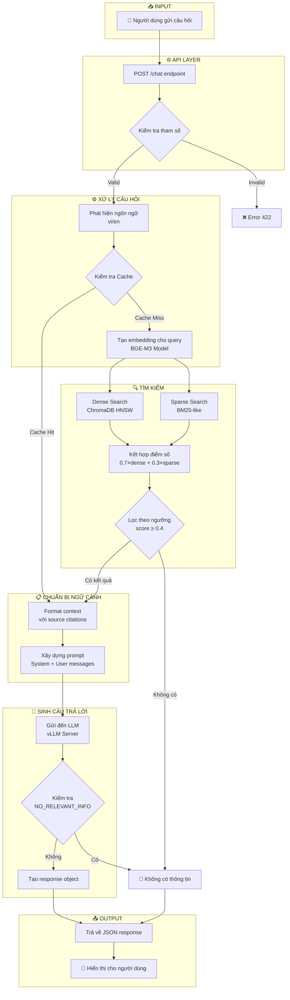
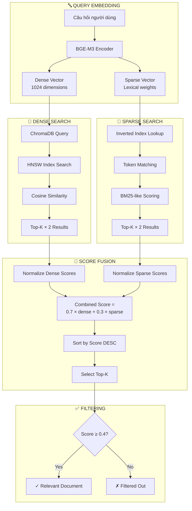
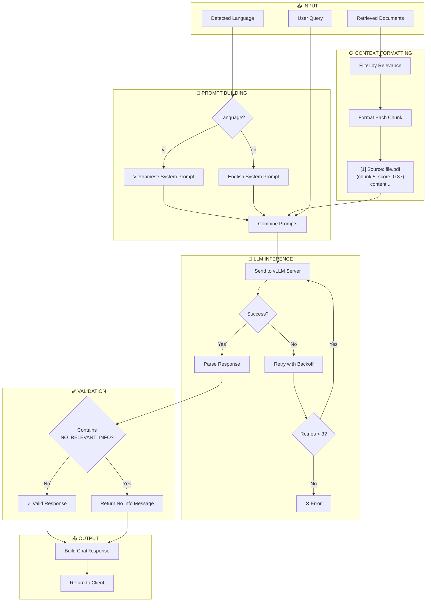
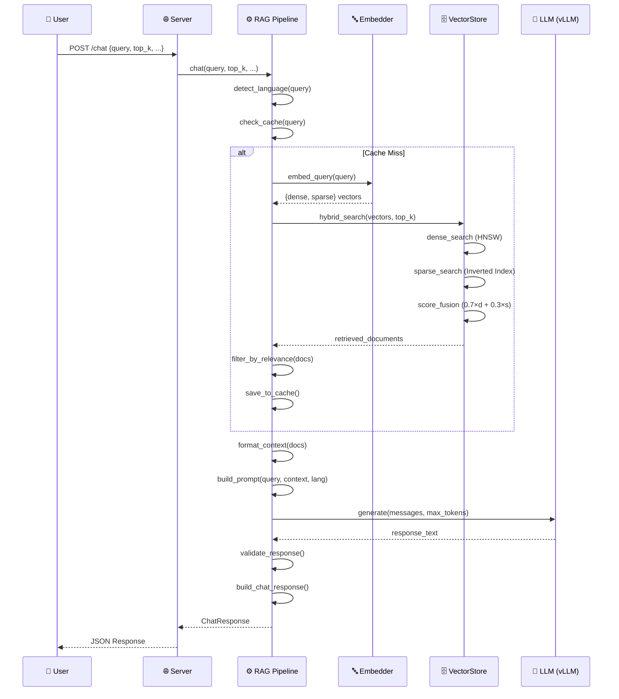

# Báo Cáo Luồng Hỏi Đáp Hệ Thống RAG Chatbot

## Mục Lục
1. [Tổng Quan](#1-tổng-quan)
2. [Kiến Trúc Hệ Thống](#2-kiến-trúc-hệ-thống)
3. [Flowchart Luồng Hỏi Đáp](#3-flowchart-luồng-hỏi-đáp)
4. [Chi Tiết Từng Bước](#4-chi-tiết-từng-bước)
5. [Các Thành Phần Chính](#5-các-thành-phần-chính)
6. [Cấu Hình Hệ Thống](#6-cấu-hình-hệ-thống)

---

## 1. Tổng Quan

Hệ thống RAG (Retrieval-Augmented Generation) Chatbot là một hệ thống hỏi đáp thông minh được xây dựng để hỗ trợ trả lời các câu hỏi về lập trình nhúng (embedded programming). Hệ thống sử dụng kỹ thuật RAG để kết hợp:

- **Retrieval (Truy xuất)**: Tìm kiếm thông tin liên quan từ cơ sở tri thức
- **Augmented (Tăng cường)**: Bổ sung ngữ cảnh cho câu hỏi
- **Generation (Sinh văn bản)**: Tạo câu trả lời dựa trên ngữ cảnh

### Đặc Điểm Chính
- Hỗ trợ đa ngôn ngữ: Tiếng Việt và Tiếng Anh
- Tìm kiếm lai (Hybrid Search): Kết hợp Dense + Sparse vectors
- Hỗ trợ nhiều định dạng tài liệu: PDF, DOCX, TXT, Images
- Streaming response cho trải nghiệm người dùng tốt hơn

---

## 2. Kiến Trúc Hệ Thống

```
┌─────────────────────────────────────────────────────────────────────────┐
│                           FRONTEND (Web UI)                             │
│                         frontend/index.html                             │
└─────────────────────────────────┬───────────────────────────────────────┘
                                  │ HTTP POST /chat
                                  ▼
┌─────────────────────────────────────────────────────────────────────────┐
│                        FASTAPI SERVER (server.py)                       │
│                    Host: 0.0.0.0 | Port: 8081                          │
└─────────────────────────────────┬───────────────────────────────────────┘
                                  │
                                  ▼
┌─────────────────────────────────────────────────────────────────────────┐
│                      RAG PIPELINE (rag_pipeline.py)                     │
├─────────────────────────────────────────────────────────────────────────┤
│  • Language Detection    • Query Caching    • Prompt Building          │
│  • Context Formatting    • Response Generation                          │
└──────────┬──────────────────────┬───────────────────────┬───────────────┘
           │                      │                       │
           ▼                      ▼                       ▼
┌──────────────────┐   ┌──────────────────┐   ┌──────────────────────────┐
│    EMBEDDER      │   │   VECTOR STORE   │   │      LLM (vLLM)          │
│  (embedder.py)   │   │ (vectorstore_    │   │  Qwen2.5-7B-Instruct     │
│   BGE-M3 Model   │   │   chroma.py)     │   │  Port: 8000              │
└──────────────────┘   │    ChromaDB      │   └──────────────────────────┘
                       └──────────────────┘
```

---

## 3. Flowchart Luồng Hỏi Đáp

### 3.1 Flowchart Tổng Quan (Mermaid)



### 3.2 Flowchart Chi Tiết - Quá Trình Retrieval



### 3.3 Flowchart Chi Tiết - Quá Trình Generation



---

## 4. Chi Tiết Từng Bước

### Bước 1: Tiếp Nhận Câu Hỏi (Request Reception)

**File:** `server.py` (lines 197-225)

**Endpoint:** `POST /chat`

```python
class ChatRequest(BaseModel):
    query: str              # Câu hỏi (1-2000 ký tự)
    top_k: int = 5          # Số lượng documents truy xuất (1-20)
    max_tokens: int = 1024  # Số token tối đa cho response
    stream: bool = False    # Bật/tắt streaming
    use_hybrid: bool = True # Sử dụng tìm kiếm lai
```

### Bước 2: Phát Hiện Ngôn Ngữ (Language Detection)

**File:** `rag_pipeline.py` (line 199)

Hệ thống tự động phát hiện ngôn ngữ dựa trên ký tự tiếng Việt:
- Đếm số ký tự tiếng Việt trong câu hỏi
- Nếu > 2 ký tự → Tiếng Việt (`"vi"`)
- Ngược lại → Tiếng Anh (`"en"`)

### Bước 3: Kiểm Tra Cache

**File:** `rag_pipeline.py` (lines 66-93)

- Tạo cache key từ MD5 hash của (query, top_k, use_hybrid)
- Nếu tìm thấy trong cache → Trả về kết quả ngay
- LRU Cache với kích thước mặc định: 1000 entries

### Bước 4: Tạo Embedding

**File:** `embedder.py`

Sử dụng model **BGE-M3** để tạo:
- **Dense Vector**: 1024 chiều (semantic similarity)
- **Sparse Vector**: Lexical weights (keyword matching)

```python
result = model.encode(
    [query],
    return_dense=True,
    return_sparse=True,
    return_colbert_vecs=False
)
```

### Bước 5: Tìm Kiếm Lai (Hybrid Search)

**File:** `vectorstore_chroma.py` (lines 113-207)

#### 5.1 Dense Search
- Sử dụng ChromaDB với HNSW index
- Tính cosine similarity
- Lấy top_k × 2 kết quả

#### 5.2 Sparse Search
- Sử dụng inverted index in-memory
- Tính BM25-like score
- Lấy top_k × 2 kết quả

#### 5.3 Score Fusion
```python
combined_score = 0.7 × dense_score + 0.3 × sparse_score
```

#### 5.4 Filtering
- Lọc các documents có score ≥ 0.4 (ngưỡng relevance)

### Bước 6: Chuẩn Bị Ngữ Cảnh (Context Preparation)

**File:** `rag_pipeline.py` (lines 103-129)

Format mỗi document thành:
```
[1] Source: filename.pdf (chunk 5, relevance: 0.87)
<nội dung chunk>

---

[2] Source: filename2.pdf (chunk 12, relevance: 0.75)
<nội dung chunk>
```

### Bước 7: Xây Dựng Prompt

**File:** `rag_pipeline.py` (lines 132-156)

**System Prompt (Tiếng Việt):**
```
Bạn là trợ lý chuyên gia về lập trình nhúng.

QUY TẮC QUAN TRỌNG:
- CHỈ trả lời dựa trên ngữ cảnh
- Nếu không có thông tin, trả lời: "NO_RELEVANT_INFO"
- KHÔNG ĐƯỢC bịa hoặc suy luận
- Luôn trích dẫn nguồn
```

**Prompt Structure:**
```json
[
  {"role": "system", "content": "<system prompt>"},
  {"role": "user", "content": "Context:...\nQuestion:..."}
]
```

### Bước 8: Sinh Câu Trả Lời (LLM Generation)

**File:** `rag_pipeline.py` (lines 159-185)

- **Model:** Qwen2.5-7B-Instruct
- **Server:** vLLM (http://localhost:8000/v1)
- **Temperature:** 0.7
- **Max Tokens:** 1024 (có thể cấu hình)
- **Retry:** Tối đa 3 lần với exponential backoff

### Bước 9: Trả Về Response

**File:** `rag_pipeline.py` (lines 265-279)

```json
{
  "query": "Câu hỏi gốc",
  "response": "Câu trả lời từ LLM",
  "language": "vi",
  "sources": [
    {"source": "file.pdf", "score": 0.87, "chunk_index": 5}
  ],
  "context_used": true,
  "retrieval_info": {
    "docs_found": 10,
    "docs_relevant": 3,
    "retrieve_time_ms": 125,
    "generate_time_ms": 2340,
    "total_time_ms": 2465,
    "hybrid_search": true
  }
}
```

---

## 5. Các Thành Phần Chính

### 5.1 Bảng Tổng Hợp Files

| File | Chức Năng | Mô Tả |
|------|-----------|-------|
| `server.py` | API Server | FastAPI endpoints, request handling |
| `rag_pipeline.py` | RAG Orchestration | Điều phối toàn bộ luồng Q&A |
| `vectorstore_chroma.py` | Vector Database | Hybrid search, indexing |
| `embedder.py` | Embedding Service | BGE-M3 model, dense+sparse encoding |
| `document_ingest.py` | Document Processing | PDF/DOCX/text parsing, chunking |
| `redis_store.py` | Document Storage | Raw text persistence |
| `ocr_utils.py` | Image Processing | PaddleOCR, vision captioning |
| `config.py` | Configuration | Tham số hệ thống |

### 5.2 Technology Stack

| Thành Phần | Công Nghệ |
|------------|-----------|
| Backend | FastAPI 0.115+ |
| Vector DB | ChromaDB 0.5+ |
| Embedding | BGE-M3 (BAAI) |
| LLM | Qwen2.5-7B-Instruct |
| Vision | Qwen2-VL-7B |
| OCR | PaddleOCR |
| Cache | Redis 5.0+ |
| Document | PyMuPDF, python-docx |

---

## 6. Cấu Hình Hệ Thống

### 6.1 Retrieval Configuration

| Tham Số | Giá Trị Mặc Định | Mô Tả |
|---------|------------------|-------|
| `TOP_K` | 5 | Số documents truy xuất |
| `RELEVANCE_THRESHOLD` | 0.4 | Ngưỡng relevance |
| `DENSE_WEIGHT` | 0.7 | Trọng số dense search |
| `SPARSE_WEIGHT` | 0.3 | Trọng số sparse search |

### 6.2 Chunking Configuration

| Tham Số | Giá Trị Mặc Định | Mô Tả |
|---------|------------------|-------|
| `CHUNK_SIZE` | 512 | Kích thước chunk (words) |
| `CHUNK_OVERLAP` | 50 | Overlap giữa chunks |
| `USE_SEMANTIC_CHUNKING` | true | Bật semantic chunking |

### 6.3 Generation Configuration

| Tham Số | Giá Trị Mặc Định | Mô Tả |
|---------|------------------|-------|
| `MAX_TOKENS` | 1024 | Token tối đa |
| `TEMPERATURE` | 0.7 | Độ sáng tạo |
| `MAX_RETRIES` | 3 | Số lần retry |
| `RETRY_DELAY` | 1.0s | Thời gian chờ giữa retries |

---

## 7. Sequence Diagram



---

## 8. Kết Luận

Hệ thống RAG Chatbot được thiết kế với các đặc điểm:

1. **Hiệu Quả**: Sử dụng caching và hybrid search để tối ưu performance
2. **Chính Xác**: Kết hợp semantic (dense) và lexical (sparse) search
3. **Đa Ngôn Ngữ**: Hỗ trợ tiếng Việt và tiếng Anh
4. **Trung Thực**: LLM chỉ trả lời dựa trên context, không bịa thông tin
5. **Có Trích Dẫn**: Mọi câu trả lời đều có nguồn tham khảo

---

*Báo cáo được tạo tự động - Ngày: 2025-12-10*
